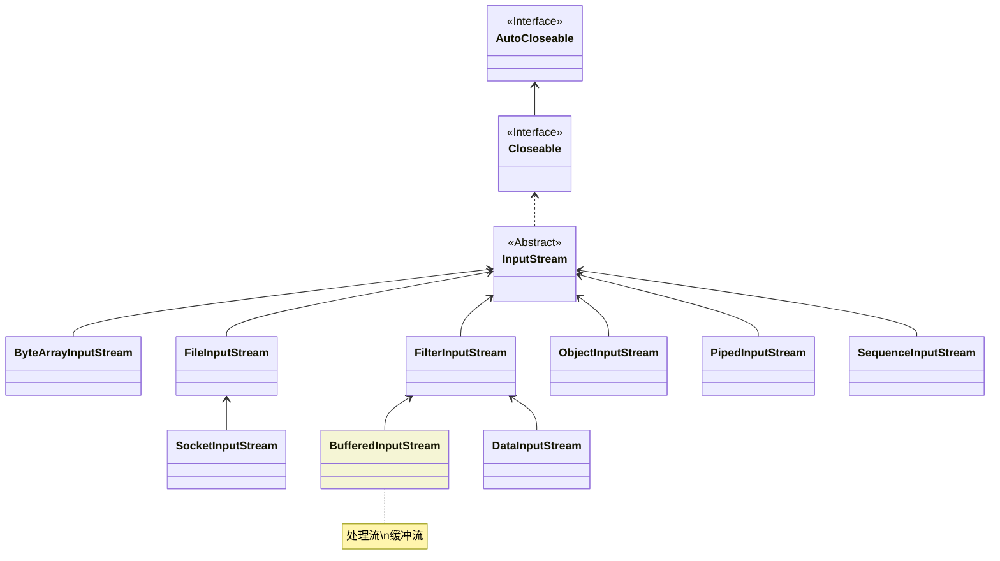

```mermaid
classDiagram

direction BT
class AutoCloseable {
<<Interface>>

}

class BufferedInputStream
style BufferedInputStream fill:#f5f5d5
note for BufferedInputStream "处理流\n缓冲流"
class ByteArrayInputStream
class Closeable {
<<Interface>>

}
class DataInputStream
class FileInputStream
class FilterInputStream
class InputStream {
    <<Abstract>>
}
class ObjectInputStream
class PipedInputStream
class SequenceInputStream
class SocketInputStream

BufferedInputStream  -->  FilterInputStream 
ByteArrayInputStream  -->  InputStream 
Closeable  -->  AutoCloseable 
DataInputStream  -->  FilterInputStream 
FileInputStream  -->  InputStream 
FilterInputStream  -->  InputStream 
InputStream  ..>  Closeable 
ObjectInputStream  -->  InputStream 
PipedInputStream  -->  InputStream 
SequenceInputStream  -->  InputStream 
SocketInputStream  -->  FileInputStream 

```