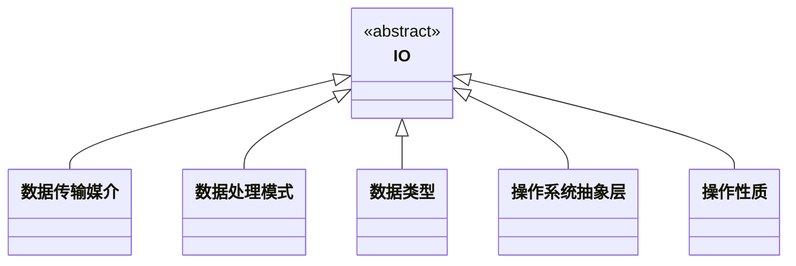

# IO 概述


## 预备知识
对IO不熟悉的请先了解[**预备知识**](pre/main.md)

## IO中的设计模式

```java
import java.io.File;
import java.io.FileInputStream;

File file;
FileInputStream fileInputStream;
```

| 分类标准            | 类型          | 目标                       | 用途                   | 示例                                            |
|---------------------|---------------|----------------------------|------------------------|-------------------------------------------------|
| **数据传输媒介**    | 文件I/O       | 磁盘或存储设备上的文件     | 数据持久化、数据处理   | 读取和写入文本文件、二进制文件、日志文件        |
|                     | 网络I/O       | 网络                       | 网络通信、数据同步     | HTTP请求和响应、FTP文件传输、Socket编程          |
|                     | 设备I/O       | 物理设备                   | 设备控制、数据采集     | 键盘输入、打印机输出、传感器数据读取            |
| **数据处理模式**    | 同步I/O       | 阻塞操作，直到完成         | 简单、直观             | 文件读取和写入、传统Socket编程                  |
|                     | 异步I/O       | 非阻塞操作，在后台进行     | 高并发、高性能         | Java NIO异步Channel、CompletableFuture          |
|                     | 阻塞I/O       | 当前线程被阻塞             | 顺序执行、简单实现     | 标准文件读取和写入、传统Socket编程              |
|                     | 非阻塞I/O     | 立即返回，不阻塞线程       | 提高并发处理能力       | Java NIO非阻塞模式、NIO Selector                |
| **数据类型**        | 文本I/O       | 文本数据                   | 可读性高的数据处理     | 读取和写入CSV文件、JSON文件、XML文件            |
|                     | 二进制I/O     | 二进制数据                 | 不可读数据处理         | 读取和写入图片、音频、视频文件                  |
| **操作系统抽象层**  | 用户空间I/O   | 编程语言和标准库           | 简化编程、跨平台支持   | Java `java.io`、`java.nio`，C `stdio.h`         |
|                     | 内核空间I/O   | 操作系统内核               | 高性能、底层控制       | Unix系统调用`read`、`write`，Windows API        |
| **操作性质**        | 读操作        | 数据源                     | 获取输入数据           | 从文件读取数据、从网络接收数据、键盘输入        |
|                     | 写操作        | 目标位置                   | 输出处理结果、存储数据 | 向文件写入数据、向网络发送数据、显示器输出      |



