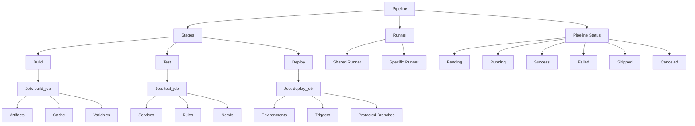

```mermaid
graph TD
    A[Pipeline]
    A --> B[Stages]
    B --> C[Build]
    B --> D[Test]
    B --> E[Deploy]

    C --> F[Job: build_job]
    F --> G[Artifacts]
    F --> H[Cache]
    F --> I[Variables]

    D --> J[Job: test_job]
    J --> K[Services]
    J --> L[Rules]
    J --> M[Needs]

    E --> N[Job: deploy_job]
    N --> O[Environments]
    N --> P[Triggers]
    N --> Q[Protected Branches]

    A --> R[Runner]
    R --> S[Shared Runner]
    R --> T[Specific Runner]

    A --> U[Pipeline Status]
    U --> V[Pending]
    U --> W[Running]
    U --> X[Success]
    U --> Y[Failed]
    U --> Z[Skipped]
    U --> AA[Canceled]

```