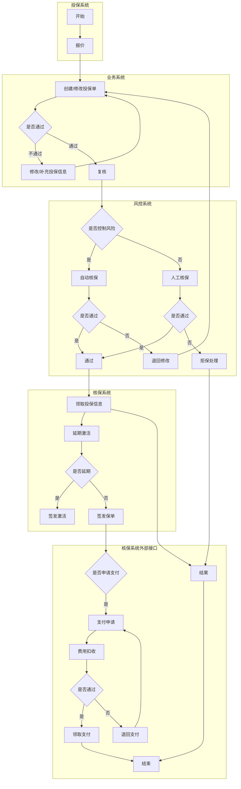

```mermaid
%% 创建横向泳道
%% Mermaid 目前不直接支持横向泳道，但我们可以用 subgraph 来模拟

flowchart TD
    subgraph 投保系统
        direction TB
        A1[开始] --> A2[报价]
    end

    subgraph 业务系统
        direction TB
        A2 --> B1[创建/修改投保单]
        B1 --> B2{是否通过}
        B2 -- 不通过 --> B3[修改/补充投保信息]
        B3 --> B1
        B2 -- 通过 --> B4[复核]
    end

    subgraph 风控系统
        direction TB
        B4 --> C1{是否控制风险}
        C1 -- 是 --> C2[自动核保]
        C2 --> C3{是否通过}
        C3 -- 是 --> C4[通过]
        C3 -- 否 --> C5[退回修改]
        C5 --> B1

        C1 -- 否 --> C6[人工核保]
        C6 --> C7{是否通过}
        C7 -- 是 --> C4[通过]
        C7 -- 否 --> C8[拒保处理]
    end

    subgraph 核保系统
        direction TB
        C4 --> D1[领取投保信息]
        D1 --> D2[延期激活]
        D2 --> D3{是否延期}
        D3 -- 是 --> D4[签发激活]
        D3 -- 否 --> D5[签发保单]
    end

    subgraph 核保系统外部接口
        direction TB
        D5 --> E1{是否申请支付}
        E1 -- 是 --> E2[支付申请]
        E2 --> E3[费用扣收]
        E3 --> E4{是否通过}
        E4 -- 是 --> E5[领取支付]
        E4 -- 否 --> E6[退回支付]
        E6 --> E2

        C8 --> F1[结果]
        E5 --> F2[结束]
        F1 --> F2
        D1 --> F1
    end

```